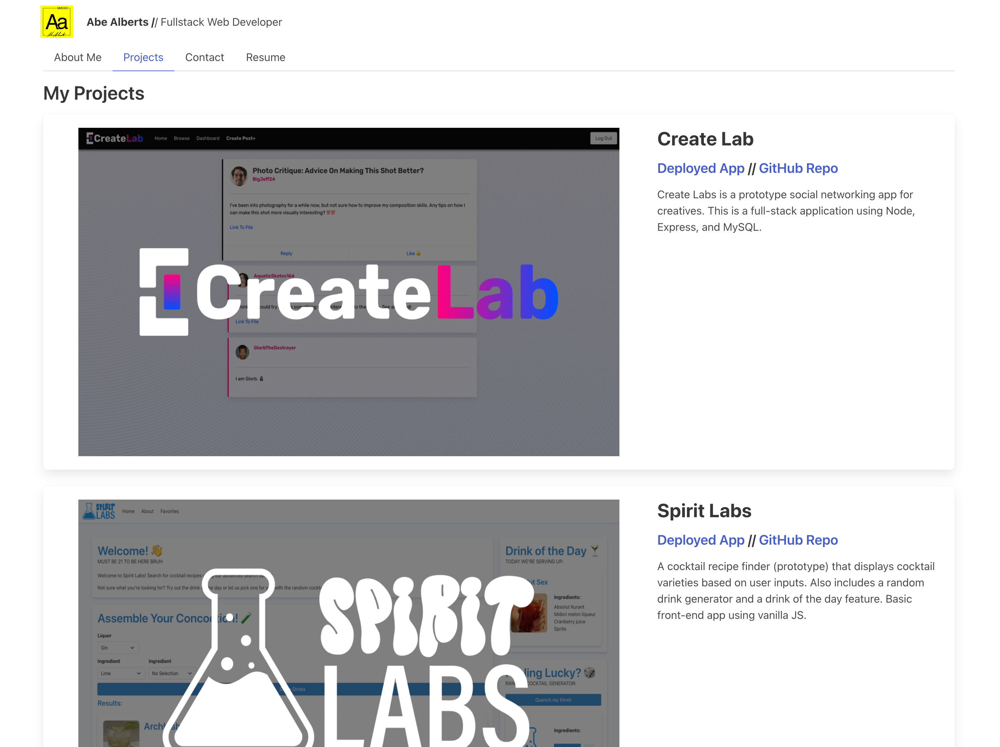

# AA-React-Porfolio

## Description

This project is a simple front-end portfolio using React:

- I created this portfolio to showcase my dev projects and allows interested parties to learn more about me/find me on other platforms.
- I feel it is important to utilize my own knowledge of development tools (React, for example) to build the platform I showcase my work on. A portfolio page like this is often a first impression to an employer/client. Therefore, it should make a positive impact/be impressive.
- I would like to further develop this project stylistically and functionally, as I can certainly make it more impressive and fleshed out with more time. Ideally, I will hook it up to a DB as well to store things like project information and form submissions.

## Usage

### [Visit my portfolio by clicking this link!](https://main--ephemeral-granita-96fbc6.netlify.app/)

## Credits

- UofW Bootcamp Repo referenced React Router set up & some functionality

## License

MIT